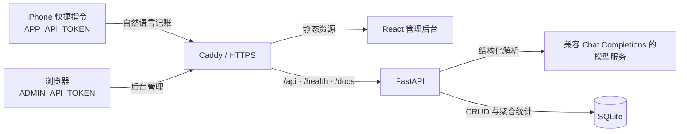

<div align="center">

# Pocket Ledger

说一句话完成记账，再用自托管后台查询、修正与分析。

[](https://github.com/HHN224/bill-agent/stargazers)
[](https://www.python.org/)
[](https://fastapi.tiangolo.com/)
[](https://react.dev/)
[](https://docs.docker.com/compose/)

[快速开始](#快速开始) · [使用方式](#使用方式) · [API](#api-速查) · [部署](#docker-部署) · [文档](#项目文档)

</div>

## 这是什么？

Pocket Ledger 是一个面向个人使用的自托管记账系统。它把 iPhone 快捷指令中的自然语言转成结构化账单，也提供 React 管理后台，用于手工记账、筛选、编辑和查看收支图表。

系统采用 FastAPI、SQLAlchemy、Alembic 与 SQLite，并通过两枚独立的 Bearer Token 隔离手机入口和管理入口。生产环境可由 Docker Compose 与 Caddy 单机部署。

## 功能

- **自然语言记账**：解析金额、收支类型、分类、时间、商户、支付方式和备注。
- **安全确认**：没有解析到有效金额时返回待确认结果，不写入数据库。
- **管理后台**：支持手工新增、分页列表、多条件筛选、详情、编辑和删除。
- **可视化统计**：提供今日、月度、分类和每日支出汇总。
- **权限隔离**：`APP_API_TOKEN` 只开放快捷指令能力，`ADMIN_API_TOKEN` 负责后台管理。
- **自托管部署**：Caddy 自动 HTTPS，同源托管前端并代理 API；SQLite 数据持久化到宿主机。

## 架构

下面是生产部署的数据流。本地开发时，Vite 会把 `/api` 直接代理到 FastAPI。



## 快速开始

### 1. 启动后端

需要 Python 3.11 或更高版本。

```powershell
python -m venv .venv
.\.venv\Scripts\Activate.ps1
python -m pip install -r requirements.txt
Copy-Item .env.example .env
```

<details>
<summary>macOS / Linux</summary>

```bash
python3 -m venv .venv
source .venv/bin/activate
python -m pip install -r requirements.txt
cp .env.example .env
```

</details>

编辑 `.env`，至少设置两枚不同的随机 Token，并填写模型配置：

```dotenv
APP_API_TOKEN=replace-with-a-long-random-token
ADMIN_API_TOKEN=replace-with-a-different-long-random-token
DEFAULT_TIMEZONE=Asia/Taipei
DATABASE_URL=sqlite:///./data/bookkeeping.db

LLM_API_KEY=your-api-key
LLM_BASE_URL=https://api.openai.com/v1
LLM_MODEL=your-model-name
LLM_TIMEOUT_SECONDS=8
```

初始化数据库并启动 API：

```powershell
python -m alembic upgrade head
python run.py
```

服务启动后可访问：

- 健康检查：<http://127.0.0.1:8000/health>
- Swagger UI：<http://127.0.0.1:8000/docs>
- OpenAPI JSON：<http://127.0.0.1:8000/openapi.json>

### 2. 启动管理后台

另开一个终端：

```powershell
cd frontend
npm ci
npm run dev
```

打开 <http://127.0.0.1:5173>，使用 `.env` 中的 `ADMIN_API_TOKEN` 登录。开发服务器会把 `/api` 代理到 `127.0.0.1:8000`，无需额外配置 CORS。

## 使用方式

### iPhone 快捷指令

快捷指令只需要调用自然语言入口：

1. 用“询问输入”获取一句记账文本。
2. 创建字典，将 `text` 设为输入结果，并传入可选的 IANA `timezone`。
3. 用“获取 URL 内容”向 `https://你的域名/api/transactions/parse-and-create` 发起 `POST`。
4. 请求体选择 JSON，并添加请求头 `Authorization: Bearer 你的APP_API_TOKEN`。
5. 显示响应中的 `message`。

请求体示例：

```json
{
  "text": "中午食堂牛肉饭18块5，微信支付",
  "timezone": "Asia/Taipei"
}
```

不要把 `ADMIN_API_TOKEN` 放进快捷指令。

### 管理后台

后台使用 `ADMIN_API_TOKEN`，覆盖以下操作：

- 查看今日和月度收支图表；
- 按日期、分类、类型和关键词筛选账单；
- 手工创建账单，不调用大模型；
- 查看、修改或永久删除单笔账单。

Token 只保存在页面内存中，不会写入 URL、源码、构建产物或 `localStorage`。刷新页面后需要重新输入。

## API 速查

受保护接口统一使用：

```text
Authorization: Bearer <token>
```

| 方法 | 路径 | Token | 用途 |
| --- | --- | --- | --- |
| `POST` | `/api/transactions/parse-and-create` | APP | 解析自然语言并在信息有效时创建账单 |
| `POST` | `/api/transactions/manual` | ADMIN | 直接创建结构化账单，不调用模型 |
| `GET` | `/api/transactions` | ADMIN | 分页查询，并按日期、分类、类型或关键词筛选 |
| `GET` | `/api/transactions/{id}` | ADMIN | 查询单笔账单 |
| `PATCH` | `/api/transactions/{id}` | ADMIN | 修正单笔账单 |
| `DELETE` | `/api/transactions/{id}` | ADMIN | 永久删除单笔账单 |
| `GET` | `/api/summaries/daily` | APP 或 ADMIN | 获取默认时区中的今日汇总 |
| `GET` | `/api/summaries/monthly` | ADMIN | 获取指定年月的收支与分类汇总 |

完整字段、查询参数、响应和错误格式见 [后台 API 契约](docs/admin-api.md) 或运行中的 Swagger UI。

## 配置

| 变量 | 用途 |
| --- | --- |
| `APP_API_TOKEN` | iPhone 快捷指令专用 Token |
| `ADMIN_API_TOKEN` | 管理后台与管理 API 专用 Token |
| `DEFAULT_TIMEZONE` | 日期解析、筛选和统计使用的默认 IANA 时区 |
| `DATABASE_URL` | SQLAlchemy 数据库地址 |
| `LLM_API_KEY` | 模型服务密钥 |
| `LLM_BASE_URL` | 兼容 Chat Completions 的 API 基础地址 |
| `LLM_MODEL` | 模型名称 |
| `LLM_TIMEOUT_SECONDS` | 单次模型调用超时秒数 |
| `DOMAIN` | Docker + Caddy 部署使用的域名 |
| `DATA_HOST_DIR` | VPS 上的 SQLite 数据目录 |
| `BACKUP_HOST_DIR` | VPS 上的一致性备份目录 |

完整示例见 [`.env.example`](.env.example)。`.env` 已被 Git 忽略；不要把真实 Token 或模型密钥写进源码、README、截图、Issue 或提交记录。

## Docker 部署

生产环境需要一台安装了 Docker 的 VPS、一个已解析到该服务器的域名，以及开放的 80/443 端口。

```bash
cp .env.example .env
# 编辑 .env：设置 DOMAIN、Token、模型配置和数据目录
docker compose up -d --build
```

部署后，Caddy 会：

- 自动签发和续期 HTTPS 证书；
- 同源托管 `frontend/dist`；
- 把 `/api`、`/health` 和 API 文档路由代理到 FastAPI；
- 仅在 Compose 内网暴露应用的 8000 端口。

升级、回滚、Token 轮换、SQLite 备份与恢复请严格按照 [部署手册](docs/deployment.md) 操作。不要执行 `docker compose down -v`，也不要删除 `DATA_HOST_DIR`。

## 项目结构

```text
.
├── app/
│   ├── routers/              # 交易与统计 API
│   └── services/             # 模型客户端、解析器与统计服务
├── data/                     # 本地 SQLite 数据目录
├── docs/
│   └── adr/                  # 架构决策记录
├── frontend/
│   ├── src/                  # React 管理后台
│   └── tests/                # Vitest 与 Playwright 测试
├── migrations/               # Alembic 迁移
├── tests/                    # Python 单元、API 与端到端测试
├── .dockerignore
├── .env.example
├── .gitignore
├── alembic.ini
├── Caddyfile
├── CONTEXT.md
├── docker-compose.yml
├── Dockerfile
├── pytest.ini
├── requirements.txt
└── run.py
```

## 测试与质量检查

后端：

```powershell
python -m pytest -q
python -m alembic check
```

前端：

```powershell
cd frontend
npm run test
npm run lint
npm run typecheck
npm run build
```

Playwright 端到端测试需要已启动的后端，并通过环境变量注入管理 Token：

```powershell
$env:E2E_ADMIN_TOKEN = "本地 .env 中的 ADMIN_API_TOKEN"
npm run test:e2e
```

## 项目文档

| 文档 | 内容 |
| --- | --- |
| [后台 API 契约](docs/admin-api.md) | 请求、响应、筛选、分页和错误格式 |
| [部署与运维手册](docs/deployment.md) | VPS 部署、更新、回滚、Token 轮换、备份与恢复 |
| [后台 MVP 边界](docs/admin-backlog.md) | 已实现范围和后续候选需求 |
| [领域术语](CONTEXT.md) | 核心概念、规则和项目边界 |
| [单 VPS 与 Token 鉴权 ADR](docs/adr/0001-single-vps-deployment-and-token-auth.md) | 部署与鉴权的初始决策 |
| [快捷指令与后台 Token 拆分 ADR](docs/adr/0002-separate-shortcut-and-admin-tokens.md) | 两枚 Token 的安全边界 |

## 安全边界

Pocket Ledger 当前是单用户系统，不是完整的多用户账号平台：

- `APP_API_TOKEN` 和 `ADMIN_API_TOKEN` 必须不同，且都应使用足够长的随机值；
- 手机 Token 不能读取、修改或删除已有账单；
- 后台 Token 不能调用自然语言解析入口；
- 任一 Token 未配置时，对应接口会拒绝访问；
- 浏览器端凭证不持久化；如需长期登录或多用户，应改用服务端会话与 `HttpOnly` Cookie。

## 参与贡献

欢迎通过 Issue 描述问题或改进建议。提交 Pull Request 前，请确保相关后端与前端检查通过，并且没有提交 `.env`、数据库、Token 或模型密钥。

<a href="https://github.com/HHN224/bill-agent/graphs/contributors">
  
</a>